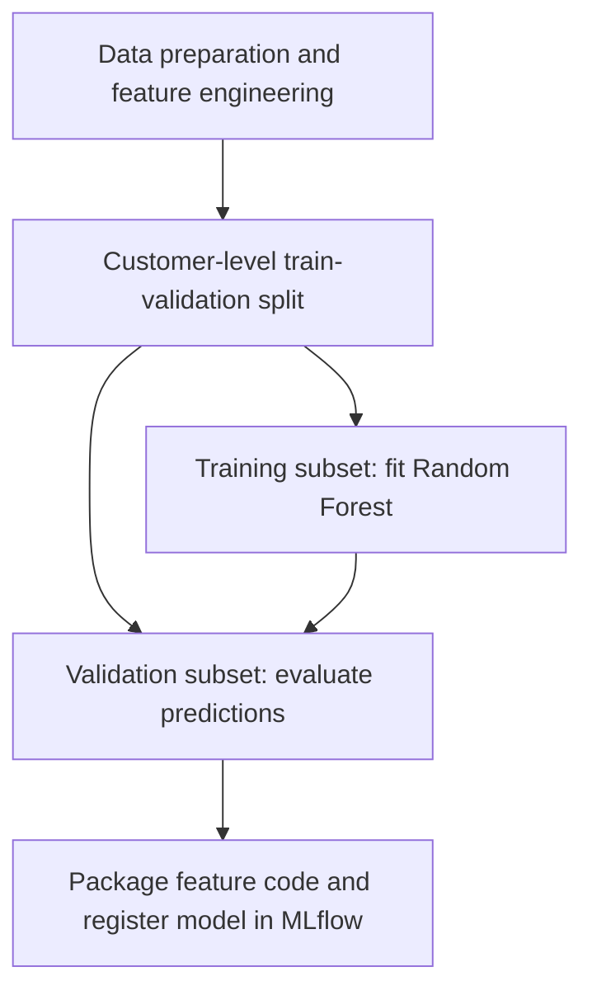

# Customer Retention with Machine Learning

Personal project portfolio by **Samuel González**, documenting collaborative work with **Thunderbolt** during the **Caja de Ahorros Hackathon 2026** in Panama.

**Recognition:** Hackathon finalist  
**Project type:** Collaborative machine learning prototype  
**Repository status:** Documentation in progress

## Project Overview

The challenge focused on analyzing customer churn in deposit products and developing a classification model to support customer retention decisions.

Our team worked through data preparation, feature engineering, model training, evaluation, registration, and a final technical presentation during a 48-hour development challenge.

This repository documents my participation, the team's approach, and the lessons learned.

## My Contribution

All five team members participated across the project lifecycle as part of a shared learning experience.

I contributed to:

- Data exploration, cleaning, and preparation.
- Python programming and feature engineering.
- Model training and evaluation.
- Model registration in MLflow.
- Interpretation and communication of results.
- Presentation preparation and team coordination.

The implementation and results were a collective effort. This portfolio describes my involvement without claiming sole authorship of the team's work.

## Project Workflow

The following diagram summarizes the development workflow used during the hackathon. The original data and trained model are not distributed in this repository.

Registration completed the technical submission process. Production deployment and the proposed retention pilot were outside the completed project scope.

## Technical Approach

The documented solution used:

- A Random Forest classifier with 300 trees.
- Ten features derived from customer profile information and historical balances.
- A stratified customer-level split: 75% for training and 25% for validation.
- AUC-ROC, Kolmogorov–Smirnov (KS), and Lift at the top 20% for internal evaluation.
- MLflow for model registration and packaging of feature transformation code.

The proposed business application was to prioritize customers for human review and evaluate whether appropriate outreach could improve retention.

## Technology Stack

- **Language:** Python
- **Data processing:** pandas, NumPy
- **Machine learning:** scikit-learn
- **Development environment:** Amazon SageMaker Unified Studio
- **Model tracking and registry:** MLflow

## Evaluation and Limitations

The available performance results come from internal validation, not the judges' independent evaluation.

The project did not establish that every input signal preceded the customer's cancellation. A customer-level train-validation split alone does not resolve this temporal limitation.

Before operational use, further work would be needed to:

- Define a prediction cutoff and a future outcome window.
- Verify that all features were available before the predicted event.
- Evaluate performance on later, unseen data.
- Measure the effect and cost of retention interventions.

The prototype was not deployed in production. No claim is made about customers retained, revenue generated, or financial savings.

## Data Confidentiality

This repository currently contains project documentation only.

Customer records, original datasets, credentials, internal infrastructure configuration, and trained model artifacts are excluded.

Any future code or presentation materials will be reviewed for confidentiality and authorship before publication. If an independent demonstration using synthetic data is added, it will be clearly distinguished from the original hackathon submission.

## Key Takeaways

- Feature engineering requires business reasoning and attention to when information becomes available.
- Strong internal metrics do not establish future performance or business impact.
- Reproducible transformations help connect model development with evaluation.
- Clear communication makes technical decisions and limitations easier to assess.

## Recognition and Teamwork

I participated as a member of Thunderbolt and was a finalist in the Caja de Ahorros Hackathon 2026.

[View my hackathon certificate](docs/samuel-gonzalez-hackathon-2026-certificate.pdf).

## Explore the Repository

| Resource | Contents |
|---|---|
| [Methodology](docs/methodology.md) | Original project approach, technical decisions, and limitations |
| [Participation and recognition](docs/recognition.md) | Samuel González's participation and certificate |
| [Synthetic demo](demo/README.md) | Setup instructions and scope of the educational demonstration |
| [Demo source code](demo/train_synthetic.py) | Runnable classification example using artificial data |

The synthetic demo was created after the hackathon with AI assistance. It is separate from the original competition submission and does not reproduce customer data or original results.
  
## References

- [Official hackathon announcement](https://www.cajadeahorros.com.pa/se-anuncia-primer-hackathon-2026/)
- [Hackathon guide](https://dn80gj53djgn6.cloudfront.net/)

Institutional names identify the event context and do not imply endorsement of this repository.
